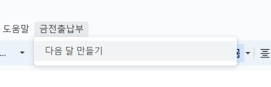

# 구글 스프레드시트 금전출납부

구글 스프레드시트용 금전출납부 스크립트

## 사용법

1. 구글에 로그인한다

2. [`금전출납부`](https://docs.google.com/spreadsheets/d/1sfao79Wi9bQh5bOQOHW_BL3LVml6QdwSQ2JyHN56HP4/edit?usp=sharing) > `파일` > `사본 만들기`를 한다


3. (선택) `이름`과 `폴더`를 바꾼다


4. `사본 생성`을 한다

5. `확장 프로그램` > `Apps Script`에 간다


6. `function myFunction() { }`을 지우고 다음 [스크립트](script.gs)를 붙여 넣고 저장한다

```js
function onOpen() { SpreadsheetApp.getUi().createMenu("금전출납부").addItem("다음 달 만들기", "createNextMonth").addToUi(); } function createNextMonth() { const activeSpreadsheet = SpreadsheetApp.getActiveSpreadsheet(); const sheets = activeSpreadsheet.getSheets(); const currentSheet = sheets[0]; const currentSheetName = currentSheet.getSheetName(); let [year, month] = currentSheetName.split(" "); year = Number(year.slice(0, -1)); month = Number(month.slice(0, -1)) + 1; if (month === 13) { const ui = SpreadsheetApp.getUi(); if ( ui.alert( `'${year + 1}년 1월'을 만들까요? '아니요'를 선택하면 '다음 달 만들기'가 취소됩니다.`, ui.ButtonSet.YES_NO ) === ui.Button.YES ) { year++; month = 1; } else { return; } } const newSheet = sheets.at(-1).copyTo(activeSpreadsheet); const newSheetName = `${year}년 ${month}월`; newSheet.setName(newSheetName); newSheet.getRange("A1").setRichTextValue( SpreadsheetApp.newRichTextValue().setText(`금전출납부 (${newSheetName})`).setTextStyle(0, 6, SpreadsheetApp.newTextStyle().setForegroundColor("#000").build()).build() ); let maxRows = currentSheet.getMaxRows(); newSheet.getRange("D3").setValue(`='${currentSheetName}'!D${maxRows}`); newSheet.getRange("E3").setValue(`='${currentSheetName}'!E${maxRows}`); newSheet.getRange("F3").setValue(`='${currentSheetName}'!F${maxRows}`); activeSpreadsheet.setActiveSheet(newSheet); activeSpreadsheet.moveActiveSheet(0); } function onEdit(event) { const range = event.range; const sheet = range.getSheet(); const rowIndex = range.getRowIndex(); if (sheet.getRange(rowIndex + 2, 3).getValue() === "월    계") { sheet.insertRowAfter(rowIndex + 1); sheet.getRange(rowIndex, 6).setValue(`=F${rowIndex - 1}+D${rowIndex}-E${rowIndex}`); } const maxRows = sheet.getMaxRows(); sheet.getRange(maxRows - 1, 4).setValue(`=SUM(D4:D${maxRows - 4})`); sheet.getRange(maxRows - 1, 5).setValue(`=SUM(E4:E${maxRows - 4})`); sheet.getRange(maxRows, 4).setValue(`=D3+D${maxRows - 1}`); sheet.getRange(maxRows, 5).setValue(`=E3+E${maxRows - 1}`); sheet.getRange(maxRows, 6).setValue(`=F${maxRows - 4}`); }
```


7. 스프레드시트를 새로고침 하고 `금전출납부` 메뉴가 생길 때까지 기다린다


8. 시트 이름을 원하는 `xx년 x월`로 바꾼다


### 다음 달 만들기

1. `금전출납부` > `다음 달 만들기`를 한다



2. `확인`한다


3. 계정을 선택한다


4. `고급` > `제목 없는 프로젝트로 이동`한다


5. `허용`한다


6. `금전출납부` > `다음 달 만들기`를 하고 다음 달이 생길 때까지 기다린다


